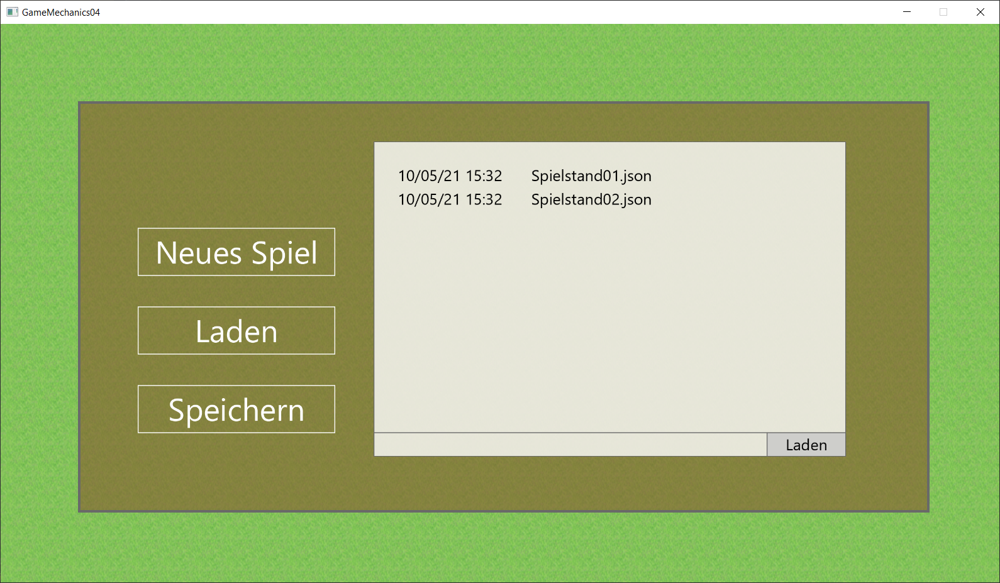
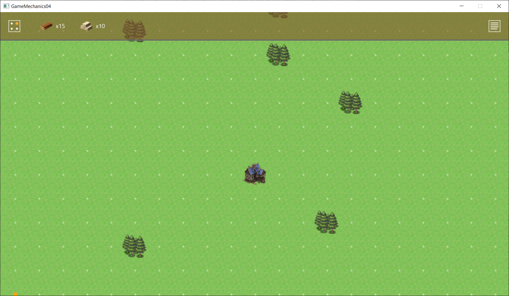
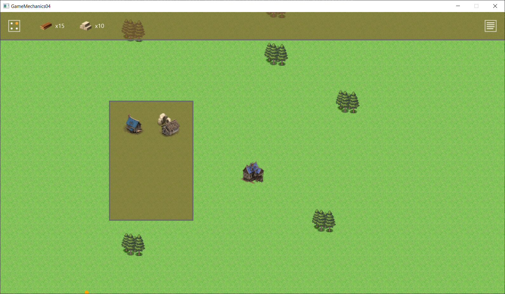
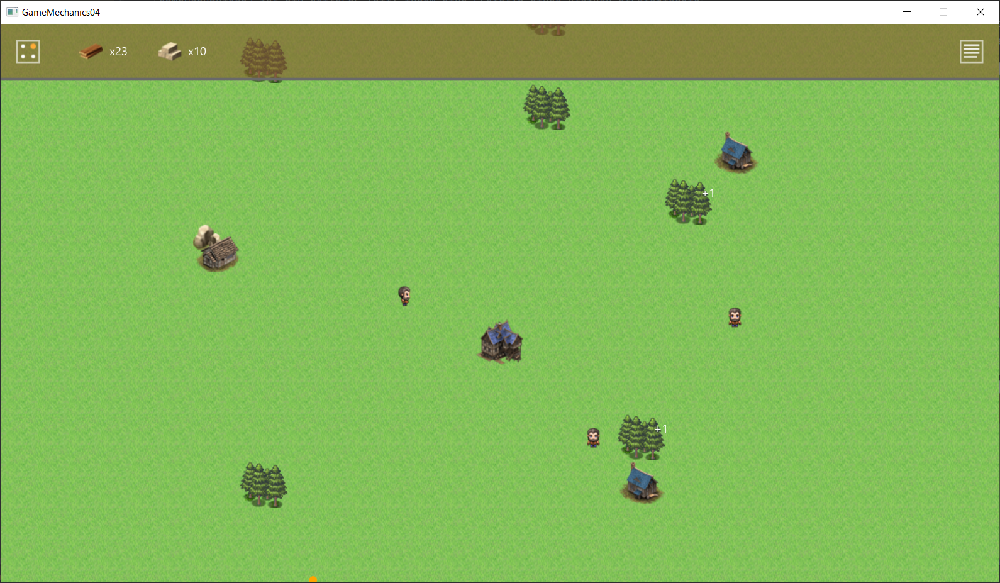

# GameMechanics04_RefactoringAndMinimap
GameMechanics04 ist ein weiterer Teil, indem eine Prototyp eines kleinen Strategiespiels entwickelt werden soll. Speziell wurde im Code der Lee-Algorithmus integriert, zur automatischen Wegfindung.

